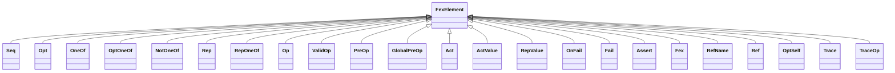
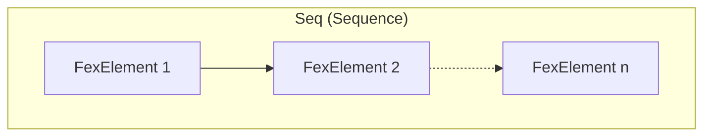
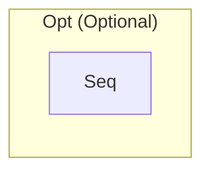
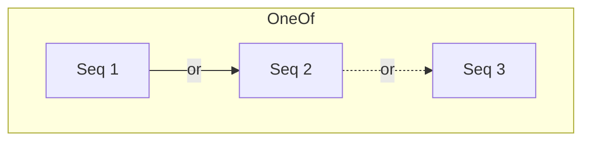
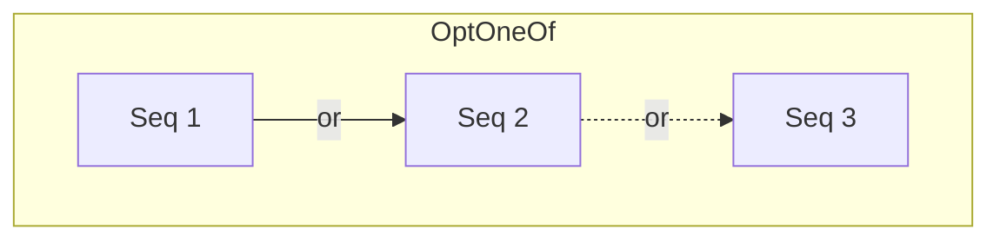
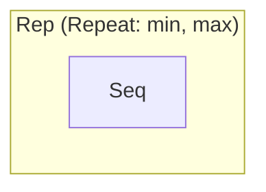
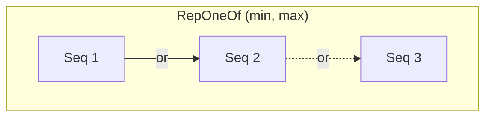

# Flow Expression Graphs

### Class Diagram

```mermaid
classDiagram
  FexElement <|-- Seq
  FexElement <|-- Opt
  FexElement <|-- OneOf
  FexElement <|-- OptOneOf
  FexElement <|-- NotOneOf
  FexElement <|-- Rep
  FexElement <|-- RepOneOf
  FexElement <|-- Op
  FexElement <|-- ValidOp
  FexElement <|-- PreOp
  FexElement <|-- GlobalPreOp
  FexElement <|-- Act
  FexElement <|-- ActValue
  FexElement <|-- RepValue
  FexElement <|-- OnFail
  FexElement <|-- Fail
  FexElement <|-- Assert
  FexElement <|-- Fex
  FexElement <|-- RefName
  FexElement <|-- Ref
  FexElement <|-- OptSelf
  FexElement <|-- Trace
  FexElement <|-- TraceOp

```

### Sequence:

```mermaid
graph LR
  subgraph "Seq (Sequence)" 
    direction LR
    A[FexElement 1] --> B[FexElement 2] -.-> C[FexElement n];
  end
```

### Optional:

```mermaid
graph LR
  subgraph "Opt (Optional)" 
    A[Seq]
  end
```

### OneOf:

```mermaid
graph LR
  subgraph OneOf
    direction LR
    A[Seq 1] -->|or| B[Seq 2] -.->|or| C[Seq 3];
  end
```

### OptOneOf:

```mermaid
graph LR
  subgraph OptOneOf
    direction LR
    A[Seq 1] -->|or| B[Seq 2] -.->|or| C[Seq 3];
  end
```

### Repeat:

```mermaid
graph LR
  subgraph "Rep (Repeat: min, max)"
    direction LR
    A[Seq];
  end
```

### RepOneOf:

```mermaid
graph LR
  subgraph "RepOneOf (min, max)"
    direction LR
    A[Seq 1] -->|or| B[Seq 2] -.->|or| C[Seq 3];
  end
```